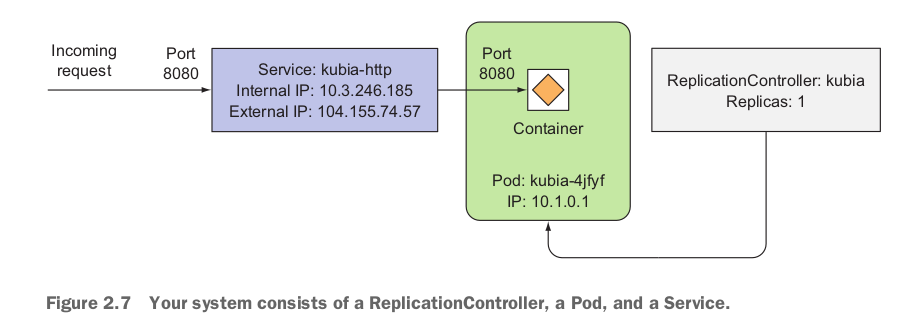

  

This repository contains the notes I am preparing for quick revision. I will be taking a few courses over the course of time and will be updating this repository with all of the stuff I learn.I will include the resources or articles I find useful while compiling this list.

# Kubernetes Notes

  

## Kubernetes Architecture 

At the hardware level, a Kubernetes cluster
is composed of many nodes, which can be split into two types:

 * The master node, which hosts the Kubernetes Control Plane that controls and manages the whole Kubernetes system

*  Worker nodes are those that run the actual applications you deploy

### Components of the control plane 

As you can see in the above diagram the control plane has five different components 

a) **kube-api-server**: This acts as the entrance to the Kubernetes control plane, responsible for validating and processing requests delivered using client libraries like the kubectl program.

b) **etcd** : This is a distributed key-value store which acts as the single source of truth about your cluster. It holds configuration data and information about the state of the cluster. etcd is an open-source project and is developed by the folks behind Red Hat. The source code of the project is hosted on the etcd-io/etcd GitHub repo.

c) **kube-controller-manager** : The controllers in Kubernetes are responsible for controlling the state of the cluster. When you let Kubernetes know what you want in your cluster, the controllers make sure that your request is fulfilled. The kube-controller-manager is all the controller processes grouped into a single process.

d) **kube-scheduler**: Assigning task to a certain node considering its available resources and the requirements of the task is known as scheduling. The kube-scheduler component does the task of scheduling in Kubernetes making sure none of the servers in the cluster is overloaded.

e) **cloud-controller-manager**: In a real world cloud environment, this component lets you wire-up your cluster with your cloud provider's (GKE/EKS) API. This way, the components that interact with that cloud platform stays isolated from components that just interact with your cluster. In a local cluster like minikube, this component doesn't exist.

Let us look at the structure of the nodes in detail

**kubelet**: This service acts as the gateway between the control plain and each of the nodes in a cluster. Every instructions from the control plain towards the nodes, passes through this service. It also interacts with the etcd store to keep the state information updated.

**kube-proxy**: This small service runs on each node server and maintains network rules on them. Any network request that reaches a service inside your cluster, passes through this service.

**Container Runtime**: Kubernetes is a container orchestration tool hence it runs applications in containers. This means that every node needs to have a container runtime like Docker or rkt or cri-o.

  

Just before we move on let us talk about the pods. Each pod has a specific IP, it is like a virtual machine in itself.Each pod is like a separate logical machine with its own IP, hostname, processes, and so on,
running a single application. The application can be a single process, running in a
single container, or it can be a main application process and additional supporting
processes, each running in its own container.

## Kubernetes Commands

`kubectl get pods` : This command lists out all the running pods. 

`kubectl get services`: List all services in the namespace.

## How to create a Kubernetes cluster with an image

`kubectl run kubia --image=luksa/kubia --port=8080`

The --image=luksa/kubia part obviously specifies the container image you want to
run, and the --port=8080 option tells Kubernetes that your app is listening on port
8080. The last flag ( --generator ) does require an explanation, though. Usually, you
won’t use it, but you’re using it here so Kubernetes creates a ReplicationController
instead of a Deployment. You’ll learn what ReplicationControllers are later in the chap-
ter, but we won’t talk about Deployments until chapter 9. That’s why I don’t want
kubectl to create a Deployment yet.

So basically kubernetes takes the container and sticks in a pod and then the control plane assigns 
the pod a worker node inside the cluster. However we cannot quite access this pod since the IP is only unique
to its cluster and cannot be accessed from outside. Hence we need to find a way to expose this to a service. 

`kubectl expose pod kubia --type=LoadBalancer --port=80`

We use a load balancer to expose this pod to the external environment. We can use the above command to expose the pod using a load balancer.

`kubectl get services`

We can then check the services using the above command.

**This is it. This is all you need to create a cluster**

## Deep dive into what just happened

The basic building block in Kubernetes is the pod. But, you didn’t really cre-
ate any pods either, at least not directly. By running the `kubectl run` command you
created a `ReplicationController`, and this ReplicationController is what created the
actual Pod object. To make that pod accessible from outside the cluster, you told
Kubernetes to expose all the pods managed by that ReplicationController as a single
Service. A rough picture of all three elements is presented in figure below.

  

**Things you need to remember**: 

a) As I said earlier the pod is the basic building block. Inside this pod is the container. A
pod can have one container or it can have multiple containers. 

b) Replication Controller: Next up you need to understand that the Replication controller is responsible for creating the pod object and maintaining the replicas. So for some reason if one of the pods goes down. The replication controller will make sure the replicas are maintained.

c) Services : In kubernetes, the pods are ephemeral. When a pod is created it gets assigned a new IP. So if one of the pods goes down the IP will change. However the service has a static ip for its entire lifecycle. And the client connects to this static IP service. The service then makes sure that it assigns the incoming HTTP request to one of the relevant pods.

# Resources

* [Kubernetes in Action](https://github.com/indrabasak/Books/blob/master/Kubernetes%20in%20Action.pdf)

* [You need to Learn Kubernetes](https://www.youtube.com/watch?v=7bA0gTroJjw&ab_channel=NetworkChuck)

Image Credits: https://stackify.com/kubernetes-guide-container-orchestration/
