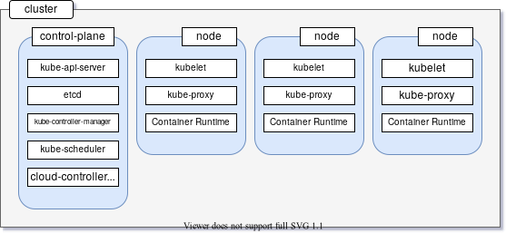
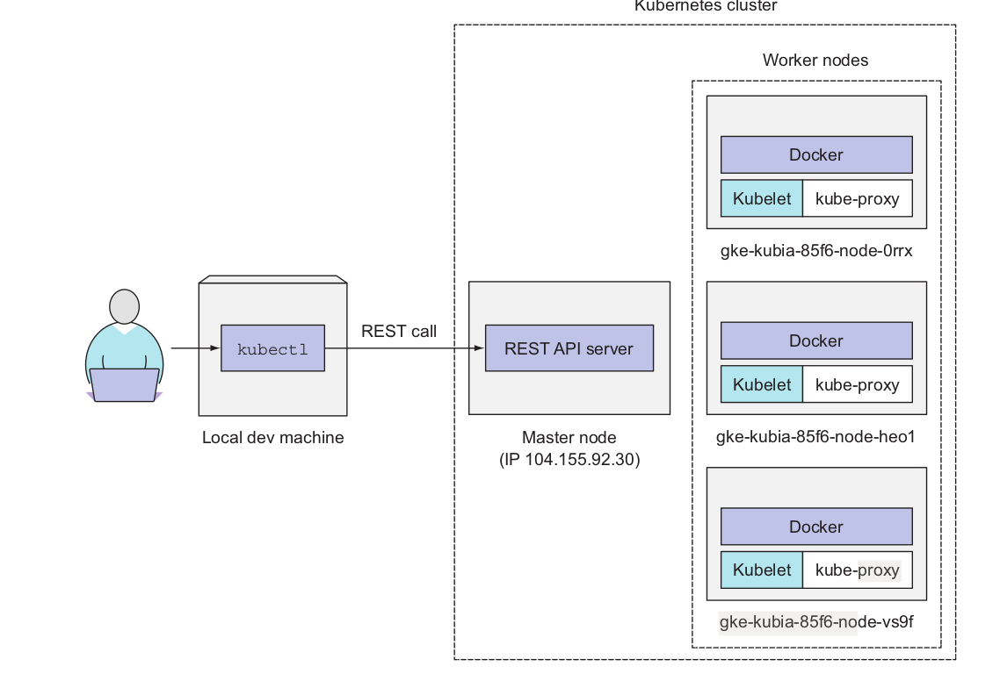

  

This repository contains the notes I am preparing for quick revision. I will be taking a few courses over the course of time and will be updating this repository with all of the information I learn.I will include the resources or articles I find useful while compiling this list.

# Kubernetes Notes

  

## Kubernetes Architecture 

At the hardware level, a Kubernetes cluster
is composed of many nodes, which can be split into two types:
 * The master node, which hosts the Kubernetes Control Plane that controls and manages the whole Kubernetes system

*  Worker nodes are those that run the actual applications you deploy

### Components of the control plane 

As you can see in the above diagram the control plane has five different components 

a) **kube-api-server**: This acts as the entrance to the Kubernetes control plane, responsible for validating and processing requests delivered using client libraries like the kubectl program.

b) **etcd** : This is a distributed key-value store which acts as the single source of truth about your cluster. It holds configuration data and information about the state of the cluster. etcd is an open-source project and is developed by the folks behind Red Hat. The source code of the project is hosted on the etcd-io/etcd GitHub repo.

c) **kube-controller-manager** : The controllers in Kubernetes are responsible for controlling the state of the cluster. When you let Kubernetes know what you want in your cluster, the controllers make sure that your request is fulfilled. The kube-controller-manager is all the controller processes grouped into a single process.

d) **kube-scheduler**: Assigning task to a certain node considering its available resources and the requirements of the task is known as scheduling. The kube-scheduler component does the task of scheduling in Kubernetes making sure none of the servers in the cluster is overloaded.

e) **cloud-controller-manager**: In a real world cloud environment, this component lets you wire-up your cluster with your cloud provider's (GKE/EKS) API. This way, the components that interact with that cloud platform stays isolated from components that just interact with your cluster. In a local cluster like minikube, this component doesn't exist.

Now let us look a the kubernetes flow diagram and how communication happens

  

So in the above image the kubectl client makes rest calls to the master node which in turn talks to the remaining worker nodes. 

## Kubernetes Commands

`kubectl get pods` : This command lists out all the running pods. 

`kubectl get services`: List all services in the namespace.

`kubectl run kubia --image=luksa/kubia --port=8080 --generator=run/v1`

The --image=luksa/kubia part obviously specifies the container image you want to
run, and the --port=8080 option tells Kubernetes that your app is listening on port
8080. The last flag ( --generator ) does require an explanation, though. Usually, you
won’t use it, but you’re using it here so Kubernetes creates a ReplicationController
instead of a Deployment. You’ll learn what ReplicationControllers are later in the chap-
ter, but we won’t talk about Deployments until chapter 9. That’s why I don’t want
kubectl to create a Deployment yet.

# Resources

* [Kubernetes in Action](https://github.com/indrabasak/Books/blob/master/Kubernetes%20in%20Action.pdf)

* [You need to Learn Kubernetes](https://www.youtube.com/watch?v=7bA0gTroJjw&ab_channel=NetworkChuck)

Image Credits: https://stackify.com/kubernetes-guide-container-orchestration/
