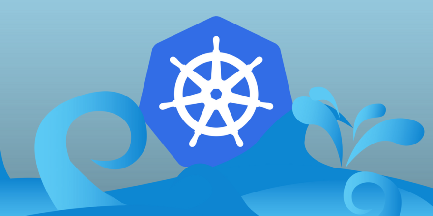
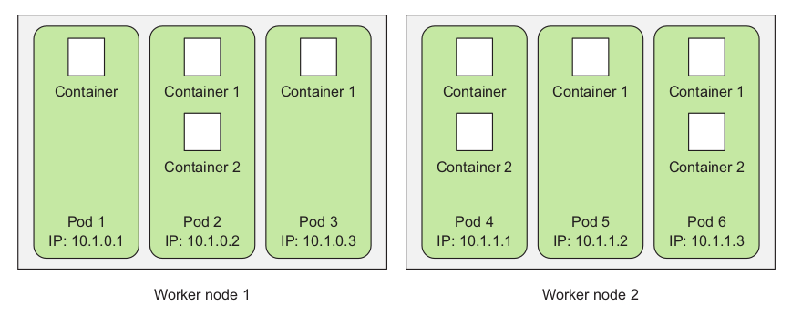
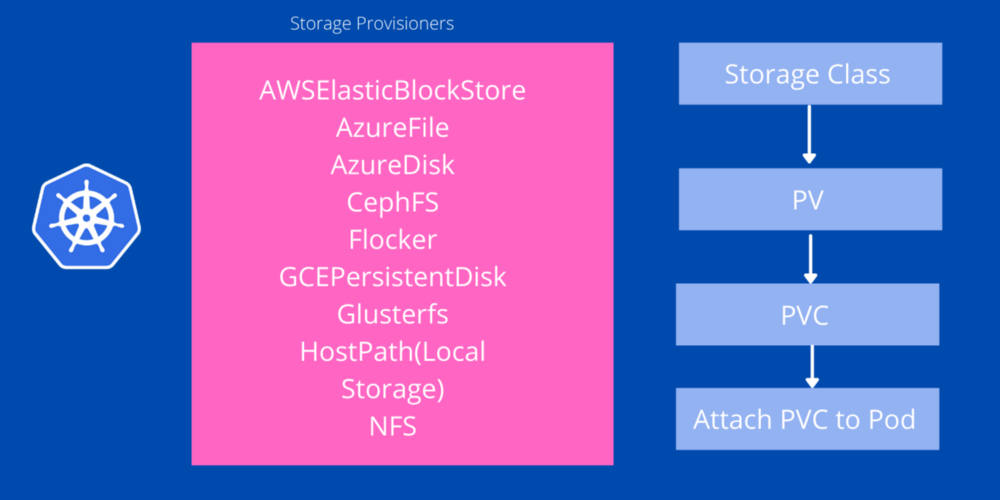

<p align="center">
  
</p>


This repository contains the notes I am preparing for quick revision. I will be taking a few courses over the course of time and will be updating this repository with all of the stuff I learn.I will include the resources or articles I find useful while compiling this list.

# Kubernetes Notes


## Kubernetes Architecture 

At the hardware level, a Kubernetes cluster
is composed of many nodes, which can be split into two types:

 * The master node, which hosts the Kubernetes Control Plane that controls and manages the whole Kubernetes system

*  Worker nodes are those that run the actual applications you deploy

### Components of the control plane 

As you can see in the above diagram the control plane has five different components 

a) **kube-api-server**: This acts as the entrance to the Kubernetes control plane, responsible for validating and processing requests delivered using client libraries like the kubectl program.

b) **etcd** : This is a distributed key-value store which acts as the single source of truth about your cluster. It holds configuration data and information about the state of the cluster. etcd is an open-source project and is developed by the folks behind Red Hat. The source code of the project is hosted on the etcd-io/etcd GitHub repo.


c) **kube-controller-manager** : The controllers in Kubernetes are responsible for controlling the state of the cluster. When you let Kubernetes know what you want in your cluster, the controllers make sure that your request is fulfilled. The kube-controller-manager is all the controller processes grouped into a single process.

d) **kube-scheduler**: Assigning task to a certain node considering its available resources and the requirements of the task is known as scheduling. The kube-scheduler component does the task of scheduling in Kubernetes making sure none of the servers in the cluster is overloaded.

e) **cloud-controller-manager**: In a real world cloud environment, this component lets you wire-up your cluster with your cloud provider's (GKE/EKS) API. This way, the components that interact with that cloud platform stays isolated from components that just interact with your cluster. In a local cluster like minikube, this component doesn't exist.

Let us look at the structure of the nodes in detail

**kubelet**: This service acts as the gateway between the control plain and each of the nodes in a cluster. Every instructions from the control plain towards the nodes, passes through this service. It also interacts with the etcd store to keep the state information updated.

**kube-proxy**: This small service runs on each node server and maintains network rules on them. Any network request that reaches a service inside your cluster, passes through this service.

**Container Runtime**: Kubernetes is a container orchestration tool hence it runs applications in containers. This means that every node needs to have a container runtime like Docker or rkt or cri-o.

<p align="center">
  
</p>


Just before we move on let us talk about the pods. Each pod has a specific IP, it is like a virtual machine in itself.Each pod is like a separate logical machine with its own IP, hostname, processes, and so on,
running a single application. The application can be a single process, running in a
single container, or it can be a main application process and additional supporting
processes, each running in its own container.

## Kubernetes Commands

`kubectl get pods` : This command lists out all the running pods. 

`kubectl get services`: List all services in the namespace.

`kubectl logs <pod name>`: Get logs from the pod

`kubectl create -f <filename>`: Create the resource using the filename.

`kubectl port-forward <pod name> 8888:8080` : You can connect to the port in your local machine by forwarding the port. 

## How to create a Kubernetes cluster with an image

`kubectl run kubia --image=luksa/kubia --port=8080`

The --image=luksa/kubia part obviously specifies the container image you want to
run, and the --port=8080 option tells Kubernetes that your app is listening on port
8080. The last flag ( --generator ) does require an explanation, though. Usually, you
won’t use it, but you’re using it here so Kubernetes creates a ReplicationController
instead of a Deployment. You’ll learn what ReplicationControllers are later in the chap-
ter, but we won’t talk about Deployments until chapter 9. That’s why I don’t want
kubectl to create a Deployment yet.

So basically kubernetes takes the container and sticks in a pod and then the control plane assigns 
the pod a worker node inside the cluster. However we cannot quite access this pod since the IP is only unique
to its cluster and cannot be accessed from outside. Hence we need to find a way to expose this to a service. 

`kubectl expose pod kubia --type=LoadBalancer --port=80`

We use a load balancer to expose this pod to the external environment. We can use the above command to expose the pod using a load balancer.

`kubectl get services`

We can then check the services using the above command.

**This is it. This is all you need to create a cluster**

## Deep dive into what just happened

The basic building block in Kubernetes is the pod. But, you didn’t really create any pods either, at least not directly. By running the `kubectl run` command you
created a `ReplicationController`, and this ReplicationController is what created the
actual Pod object. To make that pod accessible from outside the cluster, you told
Kubernetes to expose all the pods managed by that ReplicationController as a single
Service. A rough picture of all three elements is presented in figure below.


**Things you need to remember**: 

a) As I said earlier the pod is the basic building block. Inside this pod is the container. A
pod can have one container or it can have multiple containers. 

b) Replication Controller: Next up you need to understand that the Replication controller is responsible for creating the pod object and maintaining the replicas. So for some reason if one of the pods goes down. The replication controller will make sure the replicas are maintained.

c) Services : In kubernetes, the pods are ephemeral. When a pod is created it gets assigned a new IP. So if one of the pods goes down the IP will change. However the service has a static ip for its entire lifecycle. And the client connects to this static IP service. The service then makes sure that it assigns the incoming HTTP request to one of the relevant pods.


# Pods

a) Containers in the same pod run on the same network namespace.

b)  All the containers in a pod also have the same
loopback network interface, so a container can communicate with other containers in the same pod through localhost.

c) All pods in a Kubernetes cluster reside in a single flat, shared, network-address space , which means every pod can access every other pod at the other
pod’s IP address. No NAT (Network Address Translation) gateways exist between them.
When two pods send network packets between each other, they’ll each see the actual
IP address of the other as the source IP in the packet.

`Pod spec mainly contains AKMS (API, kind, metadata, spec). With AKMS your pod gets the definition to spin up freshly in the cluster.In pod manifest file, under pod spec, you need to define the container spec. This spec carries information like container image name and image version to be fetched from Docker hub or custom repository. In container spec you need to define port which container is going to use.This can be defined by containerPort directive in the container spec of pod manifest “containerPort” defines the port on which app can be reached out inside the container`


Let us now see how to create a pod

```
apiVersion: v1
kind: Pod
metadata:
  name: kubia-manual
spec:
  containers:
  - image: luksa/kubia
    name: kubia 
    ports:
    - containerPort: 8080
      protocol: TCP
```
This is the most basic description of creating a pod using a manifest file. We need to specify the API version and the kind of resource you want to create. Furthermore you need to mention the container information inside the spec section. The rest is pretty self explanatory.

# Persistent Volumes

Kubernetes makes physical storage devices like your SSDs, NVMe disks, NAS, NFS servers available to your cluster in the form of objects called -- Persistent Volumes.

Each of these Persistent Volumes is consumed by a Kubernetes Pod (or Pods) by issuing a PersistentVolumeClaim object -- a PVC. A PVC object lets pods use storage from Persistent Volumes.

```
kind: PersistentVolume
apiVersion: v1
metadata:
      name:pv01
spec:
   capacity: # defines the capacity of PV we are creating
       storage: 10Gi #the amount of storage we are tying to claim
   accessModes: # defines the rights of the volume we are creating
      - ReadWriteOnce
      hostPath:
         path: "/tmp/data01" # path to which we are creating the volume
```

<p align="center">
  
</p>

Access Modes:
To access the persistent volume we had four different access modes. They are.
1. ReadWriteOnce(RWO)
2. ReadOnlyMany(ROX)
3. ReadWriteMany(RWX)
4. ReadWriteOncePod(RWOP)


# Persistent volume claim

PersistentVolumeClaim
In a real ecosystem, a system admin will create the PersistentVolume then a developer will create a PersistentVolumeClaim which will be referenced in a pod. A PersistentVolumeClaim is created by specifying the minimum size and the access mode they require from the persistentVolume.

```
kind: PersistentVolumeClaim
apiVersion: v1
metadata:
      name:pv
spec:
   accessModes: 
      - ReadWriteOnce
  resources:
    requests:
      storage: 256m
  storageClassName: shared
```


# Service

For a pod to be exposed to the outside world it needs a service.
A service is a k8s object and basically a firewall rule. This rule is created basically for two reasons.
a) To expose PODs to the external world.
b) You can load balance between a set of pods and get rid of pod ip change if it dies.


To expose a pod to external world you need to create a service with nodePort type. nodePort sends external traffic to the Kubernetes cluster which is received on “port” defined in service object YAML.

When you wish to access a pod as via a service, you are going to hit `host-ip:nodePort` in order to reach till k8s pod or deployment object.
Once service receives traffic from an external source it does two things.
1) First, it sends the traffic received on nodePort and forwards that to port service is listening to i.e to the port defined in “Port” directive of service object YAML.
2) The second thing what a service does. It redirects the traffic received on “Port” to “targetPort” which is the directive used to define port on which container has exposed the application.

# Replication Controllers, Replica Sets, and Deployments


Replica sets are the same this as replication controller but provide more options for selection. Having a wider range of selector options is good but what's even better is having more flexibility in terms of rolling out and rolling back updates. This is where another Kubernetes API called a Deployment comes in.

## Labels

Labels are an important feature of kubernetes and allow one to specify labels to a particular pod.This will allow you to filter these pods according to a particular label for example in the manifest we just saw above, if we want to attach a particular label to it we can do so by adding the following section. You can view the kubia-manual-with-labels to learn more about this. 

```
labels:
    creation_method: manual 
    env: prod
```

We can then easily filter the pods using some simple commands like

`kubectl get pods -l env` or `kubectl get pods -l creation-method=manual`

# Container Patterns

## Init container

In Kubernetes, an init container is the one that starts and executes before other containers in the same Pod. It’s meant to perform initialization logic for the main application hosted on the Pod. For example, create the necessary user accounts, perform database migrations, create database schemas and so on.

1) Container starts before any other container in the pod
2) The logic in the init container should not take too long to execute
3) The init container shares network with the existing containers, so we can use that to share stuff inside a DB

Some of the usecases of using init containers are:
a) Seeding a database
b) Needing to wait before a database is initialized.

# Sidecar pattern

Containers do one job and they do it well. Hence we let the main container insdie a pod do its job and let other containers take care of the reamining jobs like shipping logs. Both containers have access to the same namespace and therefore can easily perform any tasks that the main container does. 

While creating sidecar containers one needs to remember certain things

a) Making sure that the sidecar container does not consume too many resources
b) Separating of concerns are respected.
c) Common examples of sidecar containers are log shippers, log watchers, monitoring agents among others.

# Adapter pattern


# Commands

kubectl get <resource type> <resource name>
kubectl delete <resource type> <resource name> ---> Used to delete a pod


# Resources

* [Kubernetes in Action](https://github.com/indrabasak/Books/blob/master/Kubernetes%20in%20Action.pdf)

* [You need to Learn Kubernetes](https://www.youtube.com/watch?v=7bA0gTroJjw&ab_channel=NetworkChuck)

Image Credits: https://stackify.com/kubernetes-guide-container-orchestration/
